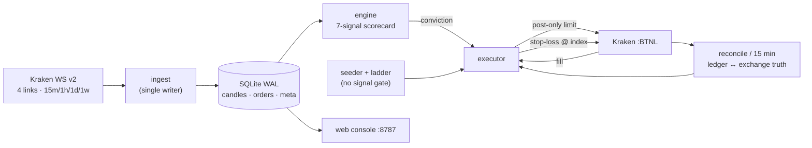

# ORACLE DEEPFIELD

Always-on Kraken cycle-bottom detector and leveraged execution engine.

It watches 29 Kraken margin pairs on a live WebSocket v2 feed, scores each one for
cycle-bottom conditions on closed daily and weekly candles, and runs a continuous
laddered accumulation book against them — every fill immediately protected by a
real stop-loss resting on the exchange, and the whole ledger reconciled against
Kraken truth every 15 minutes.

Python 3.12, ~16k lines. Runtime dependencies are `websockets` and `rich`. Everything
else — HTTP, signing, persistence, scoring, the web console — is standard library.

> **This trades real money at leverage.** `EXEC_MODE` defaults to `off` and is
> fail-closed, but when armed it places live leveraged margin orders on Kraken's
> `:BTNL` book. The automatic circuit breakers are armed (`RAILS_ENABLED = True`),
> recalibrated for the ladder in `ad5097b` after a period of running with them
> deliberately off — see [`docs/RULINGS.md`](docs/RULINGS.md). Read
> [Risk posture](#risk-posture) before arming anything.

---

## How it actually trades

The obvious reading of this repo — "a 7-signal scorecard fires a BUY, the bot buys" —
is wrong, and worth stating plainly because the code's own history walked away from it.

**The ladder is the strategy.** Every pair in the roster is seeded with a resting
post-only bid whether or not it has a signal (`SEED_PAIRS` = all 29). Each time a bid
fills, the next rung is placed immediately 1% below the fill (`LADDER_CONTINUOUS`), and
the chain walks down until it reaches the stop. Most orders this bot places never
consult a scorecard at all.

**The scorecard's live role is conviction sizing.** A confirmed BUY scales the order
(1×/2×/3× by how far score exceeds the requirement) and opens an additional entry path
that the margin floor does not gate. A backtest found the confirmed-BUY signal did not
beat buy-and-hold — its returns were beta — and `config.py` says so where the seeding
is defined. The signal survives as a sizing input and a regime lens, not as the trigger.

**Leverage is capped by the margin floor, not the size knob.** `SIZE_MULT` changes how
fast the book accumulates; `MARGIN_LEVEL_STACK_FLOOR_PCT` (200) is what actually bounds
it, by pausing all seeds and rungs whenever margin level falls below the floor.



### The seven signals

Scored on closed candles only. Six are weekly; one is daily. A pair with fewer than 30
bars scores nothing at all — every slot goes N/A rather than defaulting to favorable.

| # | Signal | Fires when |
|---|--------|-----------|
| 1 | Below W-EMA200 | Weekly close under the 200-week EMA |
| 2 | W-RSI < 40 turning up | Weekly RSI below 40 and above its value 3 bars back |
| 3 | W-MACD histogram cross-up | Histogram positive now, negative somewhere in the last 7 bars |
| 4 | D-RSI divergence | Price lower-low against RSI higher-low over 60 daily bars |
| 5 | W-first up close | Higher weekly close after 3 consecutive lower closes |
| 6 | W-volume accumulation | Weekly volume over its 20-period SMA on a green or hammer candle |
| 7 | Near 52-week low | Within 20% of the 52-week support level |

Score is the count of fired signals; the denominator counts only signals that had
enough data. **N/A shrinks the denominator and can never inflate the score** — one of
the project's non-negotiable invariants. With full data the threshold is 5 of 7.

Two details worth knowing before trusting slot boundaries: the 52-week level in signal
7 is the minimum of the last 52 weekly *closes*, not weekly lows; and signal 3 needs 41
weekly bars, because below that the MACD histogram is unseeded and its first real value
reads as a false cross-up.

---

## Architecture

One process, one asyncio event loop. Blocking work (Kraken REST, private API, DB
sweeps) is pushed off-loop with `asyncio.to_thread`.

**Four WebSocket connections, not one.** Kraken v2 permits only one OHLC interval per
symbol per connection — a second `ohlc@interval` subscribe on the same socket fails for
every symbol. So each interval gets its own link: `A(15m)`, `B(1h)`, `C(ticker+D)`,
`D(W)`. Ticker rides the daily socket deliberately, because it feeds stop math and P/L
and the daily link is the quietest. Each link has its own watchdog (20s silence forces
reconnect), app-level ping, jittered backoff capped at 60s, and a reconnect gap-heal
scoped to just that link's interval.

**The stream is transport, not truth.** Nothing is accumulated in RAM. Every recompute
re-reads the closed series from SQLite. Restarting the process loses no state.

**One writer, enforced.** Several threads hold write connections (ingest, fill polling,
gap-heal, dispatch). `_WriterConn` funnels every write through a process-global lock held
for the whole transaction, over WAL with a 30s busy timeout.

**Ingested vs traded intervals are different sets.** 15m and 1h bars are stored, healed
and displayed, but only daily and weekly drive scoring and orders. Fast bars are data to
look at, not a trigger to trade on — and firing on 15m closes would re-run the entry path
96×/day/symbol.

**Silent closes are caught by clock.** A low-volume bar produces no WebSocket message at
its border, so a watchdog scans for forming bars past their deadline and REST-confirms
them; if REST is down it defers rather than flipping, up to 30 minutes, then flips on
clock authority and says so.

**The web console makes zero Kraken calls.** The bot writes a JSON snapshot to a `meta`
row; the server opens the database read-only and renders from that. There is no IPC and
no second API consumer that could collide with the nonce.

---

## Safety model

The core rule, stated in the reconcile source and honored throughout: **act only on
definite exchange state.** A `None` from the API is never treated as "gone."

### Stops

Every filled lot gets a real `stop-loss` order resting on the exchange, triggered on the
index price. They are market stops on purpose — they must fill through a gap-down, so
they are never converted to limits. The stop level is the 52-week support, clamped to a
5–15% band below entry.

A resting limit entry is recorded `pending` and gets **no** stop, because a stop with no
position behind it opens a short. Only a confirmed fill promotes the row to `open` and
rests the stop.

### Reconciliation

`verify_open_stops()` runs at boot and every 15 minutes, matching the ledger against
Kraken by **per-pair volume budget** rather than per-row presence — the strategy stacks
many rows per pair, so "does this pair have any position?" is the wrong question. The
invariant it maintains: *resting-stop volume per pair never exceeds open long volume per
pair.* Violate it and the excess sell opens a naked short on a Non-ECP account.

It runs in two strictly ordered passes — **all removals first**, then additions — so
stop volume can never transiently exceed position volume. Along the way it handles the
cases that actually bit this system in production: a row whose own stop already executed
must not consume a sibling's backing; an orphan stop whose cancel *failed* must leave its
row open rather than be stranded; an UNKNOWN stop status must never be blindly re-placed
into a duplicate; and a stop already resting on Kraken whose txid the ledger lost is
adopted rather than doubled.

Volume on the exchange that no ledger row tracks — a manual position, another system —
is detected, alerted, and after a 30-minute stability window **adopted** into the ledger
so the normal protect path stops it. Adoption is blocked outright while any `pending` row
exists on that symbol, because that volume may be our own unbooked fill, and adopting it
would staple a second row and a second stop onto one position.

### Liquidation defense

`defense.py` is pure math and telemetry — it never places, cancels, or sizes an order.
From one live balance read it computes the adverse basket move that would reach margin
call and forced liquidation:

```
buffer_call = (equity − 0.80·margin) / notional
buffer_liq  = (equity − 0.40·margin) / notional
```

Tiers (NOMINAL / CAUTION / CRITICAL) drive escalating alerts, with the throttle key
carrying the buffer level so a worsening crash keeps paging instead of being swallowed by
the 30-minute window. A flat book reports the safest possible state, never a scarier one;
unknown inputs retain the prior tier and emit nothing, so a momentary failed read cannot
fake a recovery.

The **reverse gear** is the one actuator: below an 8% liquidation buffer it cancels
resting bids (so fills can't re-lever mid-trim) and sheds whole lots largest-notional-first
until the buffer clears 16%, capped at 4 lots per pass. It fails open — unknown or flat
never trims — and if a close fails it nulls the row's stop reference so the reprotect path
re-arms it rather than leaving a silently naked lot.

Separately, a stress poll replays the book against measured history. The figures recorded
in `config.py` from that work: worst 1-day basket move −16.76%, worst 5-day −23.17%, mean
pairwise correlation 0.60, and an effective-leverage ceiling near 4.2× to survive the worst
observed day. These are the code's own claims from `backtest_ladder.py`, kept as telemetry
thresholds — they never brake an order.

### Risk posture

Stated plainly, because the defaults are not the running configuration:

- **Automatic rails are armed.** `RAILS_ENABLED = True` since `ad5097b` (2026-07-30),
  recalibrated for the ladder era after a documented period of running with them off.
  Reachable again: `MAX_OPEN_POSITIONS = 300`, the `KILL_SWITCH_DD_PCT = 0.20` drawdown
  halt, and the `DAILY_LOSS_LIMIT_USD = 15` / `WEEKLY_LOSS_LIMIT_USD = 35` caps. Setting
  it back to `False` short-circuits `rails_ok()` and makes every one of them unreachable
  in a single edit.
- **The position cap is a runaway-loop backstop, not a working-set cap.** 300 is roughly
  10-rung chains on every pair. The brakes that actually bound the working set are the
  margin-level stack floor, the respend governor, and the `L_eff` ceiling gate — the cap
  is there to catch a loop, not to size the book.
- **The HALT file is always honored**, independent of that switch. `touch
  deepfield.HALT_ENTRIES` stops new entries immediately; delete it to resume.
- **Long only.** Kraken spot-margin has no `reduce_only`, so a resting sell can net short.
  The only sells are protective stops and the take-profit flatten. Do not add resting sells.
- **Per-pair leverage is a hardcoded maximum** and is intended to stay that way.
- Containment rests on `EXEC_SIZE_MODE = "min"` — buy the smallest placeable order.
  That is a config knob, not an invariant; flipping it to `"risk"` switches to 2%-equity
  sizing. Treat it as load-bearing.

---

## Take-profit

When live equity reaches 20% over its baseline the whole book flattens, then restacks
from the new base — a compounding stack → harvest → restack loop.

The baseline is **deposit-shifted**: an external-flow poll reads the Ledgers API and
adjusts it by net deposits and withdrawals, so +20% always measures trading profit rather
than money you wired in. Completed cycles are written to a `tp_cycles` table with their
true profit.

The flatten itself is a post-only limit chase, not a market sweep — it pegs one tick over
best bid and re-pegs as the market falls away, sized from the exchange's live volume
rounded *down* so an error leaves dust long rather than short. It cancels only its own
order ids; an account-wide cancel once stripped stops off positions the ledger had no rows
for. A flatten in progress owns the book across polls, pausing seeds and rungs so there is
no placement/cancel war.

---

## Running it

```bash
python3 -m venv venv && ./venv/bin/pip install -r requirements.txt
./venv/bin/python -m deepfield --backfill --full     # first run only, ~20-25s
```

API credentials go in `~/.deepfield_keys` — two lines, key then secret. Never in the repo.
Use a **dedicated** Kraken key: the nonce counter is per-key, and sharing one with another
bot causes nonce errors.

```bash
./venv/bin/python -m deepfield                        # live TUI, execution off
DEEPFIELD_EXEC_MODE=live ./venv/bin/python -m deepfield
```

Execution modes are exact strings, fail-closed — anything unrecognized becomes `off`
rather than being coerced, because coercing `LIVE` → `live` would arm real money on a typo.

| Mode | Behavior |
|------|----------|
| `off` | Monitor only. Default. |
| `paper` | Simulated fills recorded to the ledger. No network. |
| `validate` | Real `AddOrder` with `validate=true` — Kraken checks pair, leverage, precision, minimums and returns without executing. |
| `live` | Real leveraged orders. |

### Windows

Runs on Windows 11. The package is stdlib-portable and the whole engine — scoring,
executor, broker, store, defense, web console — behaves identically. Setup is the same
except for the venv paths:

```powershell
python -m venv venv
.\venv\Scripts\pip install -r requirements.txt
.\venv\Scripts\python -m deepfield --backfill --full
$env:DEEPFIELD_EXEC_MODE="live"; .\venv\Scripts\python -m deepfield
```

Credentials go in `%USERPROFILE%\.deepfield_keys`, same two-line format.

Two Windows-only defects have been found and fixed; both are in `master`, and the note
is kept because each was invisible on Linux and would otherwise be re-introduced:

- **`tzdata` is a hard dependency there.** Four modules bind
  `ZoneInfo("America/Denver")` at import time (`ui`, `alerter`, `simple_ui`,
  `web.server`). Linux resolves that from `/usr/share/zoneinfo`; Windows ships no
  system tz database at all, so a fresh clone raised `ZoneInfoNotFoundError` during
  collection and took out 15 test files before a single assertion ran. It is pinned in
  `requirements.txt` and is a no-op on Linux, where the stdlib prefers the system
  database.
- **The log handlers must be told they are UTF-8.** Log messages carry box-drawing,
  arrows and em-dashes — 1765 characters across 32 codepoints that `cp1252` cannot
  encode. Windows opens stdout as `cp1252`, so `StreamHandler.emit` raised
  `UnicodeEncodeError` and logging printed a stack trace *where the line should have
  been*. It never killed the bot — logging swallows handler errors — which is exactly
  why it went unnoticed. `FileHandler` had the same defect latent: opened with no
  `encoding=`, it would have corrupted the same glyphs in the log file. Both are now
  explicit in `logsetup.py`; the console falls back to `backslashreplace` rather than
  losing a record.

Three things still degrade, none of them on the money path:

- **Keyboard controls are off.** `q`/`p`/`f`/`a` need POSIX terminal control (`termios`),
  which Windows has no equivalent for. The dashboard still renders and refreshes; use
  Ctrl-C to exit and the web console for everything else.
- **Sound and desktop alerts are off.** `paplay`/`aplay`/`notify-send` are Linux; the
  chain falls back to the terminal bell. Telegram alerts work everywhere if configured.
- **`deepfield_run` and `scripts/*.sh` are bash.** Invoke `python -m deepfield` directly,
  or use the PowerShell launcher below.

`--simple` and the web console are the smoothest way to run it there.

**One-click launch.** `scripts/DEEPFIELD.desktop` is Linux-only; the Windows equivalent is
`scripts/deepfield-desktop.ps1`, installed as a shortcut by:

```powershell
.\scripts\install-desktop-icon.ps1              # desktop icon
.\scripts\install-desktop-icon.ps1 -Autostart   # + launch at every login
.\scripts\install-desktop-icon.ps1 -Uninstall   # remove both
```

It runs hidden under `pythonw`, opens the console at `:8787`, and cold-backfills on first
run if there is no database. **It launches in `paper`** — `-Mode live` is accepted for a
single run but the default is deliberate, and the shortcut never arms trading.

Two guards from the bash launcher had no Windows equivalent and are replaced, not dropped:
`pgrep` becomes a probe of `/api/health`, since the bot serves the console in-process, so
"the port answers" *is* "a bot is running" — and it is a better test than matching a
process name, which would also match an unrelated `python`. `tmux attach` becomes the web
console itself. The guard matters: two copies double the WebSocket and REST load and race
each other's alerts, and the Kraken rate limit is per-**account**, so a second instance can
throttle a bot running elsewhere on the same key.

A fresh clone has no candle database (`*.db` is correctly gitignored), so run the cold
backfill once. Until you do, two parity tests skip with "no DB (run M1 backfill)" —
that is expected on a clean checkout, not a broken install.

### CLI

```bash
--simple          # plaintext frames instead of the rich TUI
--once            # one evaluation and one frame, then exit
--web / --port    # serve the read-only console standalone
--reconcile       # one gap-heal pass, then exit
--backfill [--full]
--exec-status     # mode, rails, equity, open positions, recent orders
--exec-probe      # validate-order every pair; ground truth for which pairs have a margin book
--test-alert      # exercise the full alert chain
--test-drop       # force a WS reconnect and prove resubscribe + gap-heal
```

`--exec-probe` is the authority on roster membership. Kraken's `AssetPairs` will happily
list pairs that reject a margin order for your account; only the probe finds out. It
pruned a 132-pair candidate list to the 29 that actually have a `:BTNL` book.

### Web console

`http://127.0.0.1:8787` — the v8 "observatory deck" (v7 kept at `/v7`). Read-only,
served in-process from a read-only database handle. Shows equity and swing, the book with
per-lot stop proximity, margin level and liquidation buffer, reconcile coherence per pair,
the take-profit cycle ledger, and a live journal.

---

## Operations

**Run exactly one instance.** Two copies double the WebSocket and REST load and race each
other's alerts.

**Never issue Kraken calls from a side process while the bot is running.** The rate limit
is per *account*, not per key — a scratch verification script once throttled the live bot
blind for eight minutes. Read the logs instead; mock the broker in tests.

**Logs are never rotated or truncated.** `logsetup.py` deliberately uses an unbounded
append handler. Full history is the point.

Health at a glance:

```bash
curl -s localhost:8787/api/state | python3 -m json.tool | head -40
grep -aE "PROTECT|UNPROTECTED|NO ledger row|reconcile " logs/deepfield.log | tail
```

`recon_ok: true` with `stops_covered == stops_total` is the invariant to watch. A pair
reads not-ok when a stop status came back UNKNOWN or when untracked surplus volume was
found — both mean the ledger and the exchange disagree.

---

## Configuration

`config.py` is the operator-edited surface. The knobs that matter most:

| Knob | Default | Effect |
|------|---------|--------|
| `EXEC_MODE` | `off` | Fail-closed execution mode |
| `EXEC_SIZE_MODE` | `min` | Buy the smallest placeable order — load-bearing for containment |
| `SIZE_MULT` | `2` | Accumulation pace, not the leverage cap |
| `MARGIN_LEVEL_STACK_FLOOR_PCT` | `200` | **The real leverage cap.** Pauses seeds and rungs below it |
| `EXEC_MAX_ORDER_NOTIONAL_USD` | `50` | Per-order blast radius; refuses the order, never halts the bot |
| `LADDER_STEP_PCT` | `0.01` | Rung spacing below each fill |
| `ENTRY_TTL_SECS` | `86400` | Cancel unfilled bids after a day so they don't crowd the order cap |
| `STOP_MODE` / `STOP_MIN_PCT` / `STOP_MAX_PCT` | `support` / `0.05` / `0.15` | Stop level and its clamp band |
| `TP_PCT` | `0.20` | Flatten the book at +20% over the deposit-shifted baseline |
| `RUNTIME_RECON_SECS` | `900` | Ledger ↔ exchange reconcile period |
| `ADOPT_UNTRACKED` / `ADOPT_GRACE_SECS` | `True` / `1800` | Adopt untracked exchange volume after 30 min unclaimed |
| `REVERSE_GEAR_ENABLED` | `True` | Deleverage governor, armed by default |
| `RAILS_ENABLED` | `True` | Automatic circuit breakers — armed; `False` disables all of them at once |
| `HALT_FILE` | `deepfield.HALT_ENTRIES` | Always honored, regardless of the above |
| `MARGIN_LEVEL_ALERT_PCT` | `120` | Pages when Kraken's own margin level nears the seizure band |

`MARGIN_LEVEL_ALERT_PCT` (120) fires a throttled page when Kraken's own margin level
approaches the seizure band. It is deliberately not derived from the liq-buffer tiers:
the two measure different things and diverge widely at a mixed per-pair leverage.

---

## Tests

```bash
./venv/bin/python -m pytest tests/ -q      # 421 passed, 1 skipped
```

No test touches the network; the broker is mocked throughout and `conftest.py` isolates
the live HALT file so the operator's real kill switch can't silently suppress an entire
execution suite.

The skip count is platform- and config-dependent, so read the reasons rather than matching
the number. Three conditions skip: one POSIX-terminal test on Windows, the two parity
tests on any checkout with no candle database, and three margin-level tests whenever
`MARGIN_LEVEL_ALERT_PCT` is 0. The count quoted above is Windows with a backfilled DB and
the alert threshold armed.

The suite is heavily adversarial, and most of its interesting tests are named after
failure modes that actually happened: `test_verify_stacked_triggered_row_not_reprotected`
(duplicate stop → naked short), `test_tp_exchange_dark_aborts_untouched`,
`test_should_trim_fails_open`, `test_pending_row_blocks_adoption`,
`test_intraday_wick_is_caught_where_daily_closes_show_nothing`,
`test_dispatch_alert_failure_does_not_drop_order`. Two are written as "here is the bug,
here is the guard" — `test_sig3_fires_on_the_artifact_without_the_guard` and
`test_unpriced_low_no_longer_fabricates_a_divergence`.

---

## Layout

```
deepfield/
  app.py           runtime wiring, the 15s execution heartbeat, off-loop pollers
  executor.py      the money path: sizing, entries, stops, ladder, T/P, reconcile
  broker.py        signed Kraken private API, nonce, raw request audit log
  engine.py        scoring: ScoreCard, evaluate(), regime, conviction tranche
  signals.py       the seven signals as pure tri-state functions
  indicators.py    EMA/RSI/MACD/SMA — ported verbatim, deliberately not "improved"
  defense.py       liquidation-buffer math, escalation tiers, trim planning
  ingest.py        the single writer: queue consumer, close gating, dispatch
  ws_client.py     Kraken WS v2 client, ping/watchdog/backoff
  store.py         SQLite WAL, single-writer lock, schema
  alerter.py       tiered sound → notify-send → Telegram, throttled safety channel
  ui.py            the rich TUI (FIELD / BOOK / JOURNAL views)
  web/             read-only console, zero Kraken calls
docs/
  SPEC.md          build spec and the nine non-negotiable invariants
  RULINGS.md       authoritative overrides — supersedes SPEC prose
  AUDIT_*.md       audit findings, remediation, and orientation for auditors
```

Read [`docs/RULINGS.md`](docs/RULINGS.md) before [`docs/SPEC.md`](docs/SPEC.md) — the
rulings override the spec where they conflict, and the spec's "signal-only, no order
execution" contract is the most significant thing they overrode.

---

## Honest limitations

- Realized P&L is recorded for **stop exits only**. Manual closes and liquidations
  contribute nothing, and rollover financing is excluded from the per-trade figure — so
  a held leveraged loss reads slightly better than it is.
- Stops sit 5–15% below entry and normally fire first. The liquidation buffer is the
  backstop for gap-through risk, not the primary defense.
- The margin floor gates seeds and rungs but **not** confirmed-BUY entries, by design.
- The confirmed-BUY signal did not beat buy-and-hold in backtest. It is retained for
  conviction sizing and regime context, not for edge.
